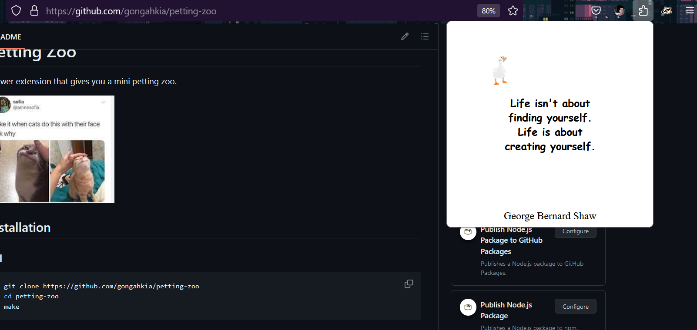
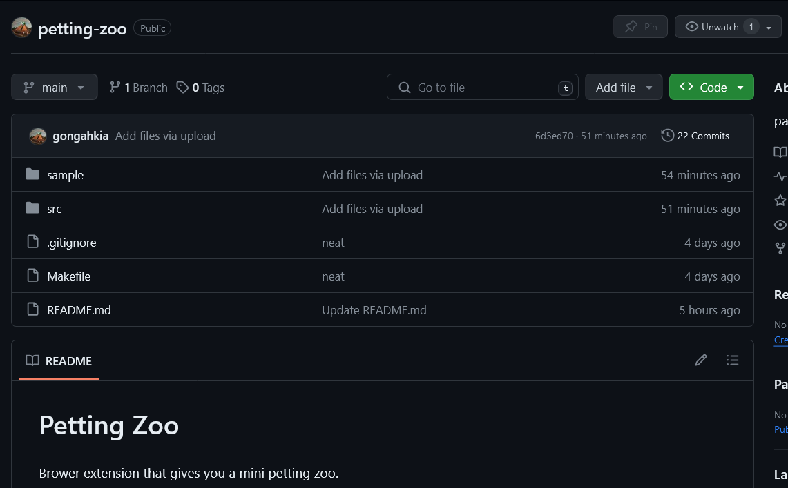
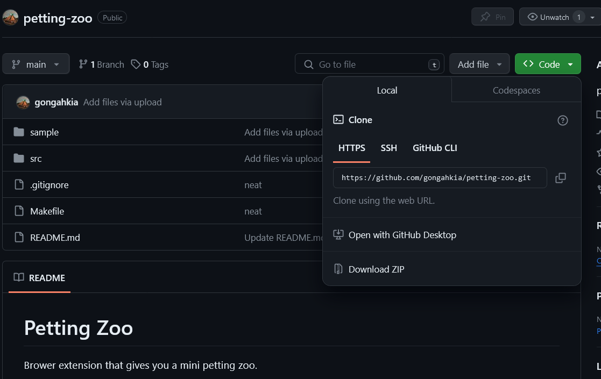

# Petting Zoo

Brower extension that gives you a mini petting zoo with motivational quotes.

## Screenshots



## Installation

### CLI

```console
$ git clone https://github.com/gongahkia/petting-zoo
$ cd petting-zoo
$ make
```

### GUI

1. Click *Code*.



2. Click *Download ZIP*.



3. Unzip the ZIP file.

## Usage 

### Firefox

1. Copy and paste this link in the search bar *about:debugging#/runtime/this-firefox*.
2. Click *load temporary add-on*.
3. Open the `petting-zoo` repo, select `manifest.json`.
4. Open any website.
5. Click the cat.

### Chrome

1. Copy and paste this link in the search bar *chrome://extensions/*.
2. Toggle *Developer mode* on.
3. Click *load unpacked*.
4. Open the `petting-zoo` repo, click *select*.
5. Open any website.
6. Click the cat.
